# Lab 06 - Build a Scheduled Flow That Summarizes List Items

## Initial Setup

- Create a new SharePoint site using a name of your choice
- Use "Team site" and the "Standard team" template
- Create a new SharePoint list called "Orders"
- Add the following columns to the "Orders" list:
  - Customer Name (Single line of text)
  - Owner Name (Single line of text)
  - Amount (Number)
  - Order Status (Choice: New, Approved, Declined)
  - Use "New" as the default for Order Status

## Create the Flow

- Navigate to <https://make.powerautomate.com> and login
- Select the target environment that will house your new Flow
- Create a new "Scheduled cloud flow" - call it something like `List Items to HTML`
- Use a trigger that executes the flow once per day on a start date and at a time of your choosing:

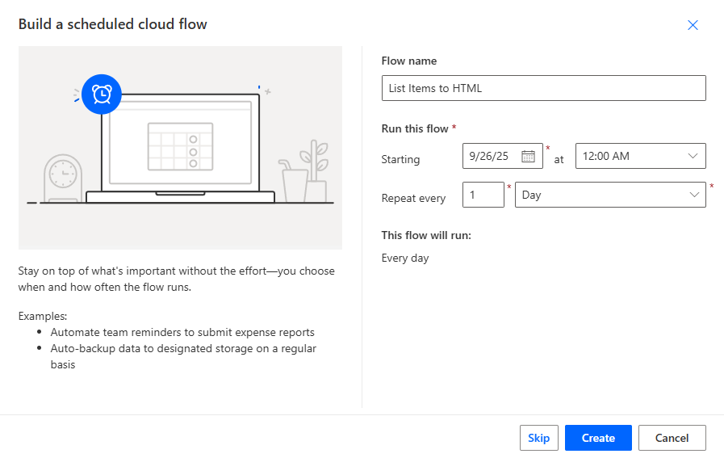

- Click **Create**
- Click on the `Recurrence` trigger and rename it to `Daily Email HTML List Items`

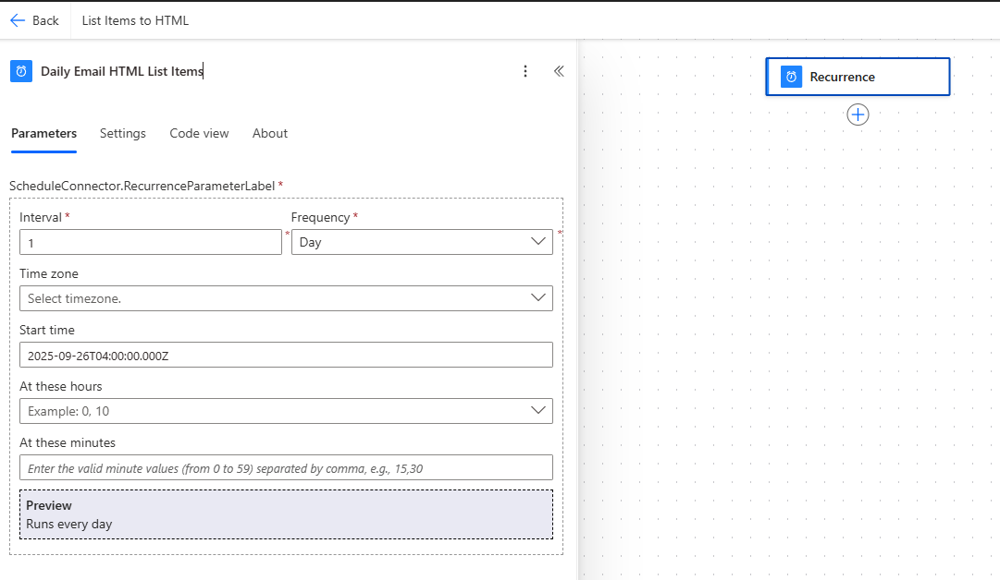

- Add a new activity, search for "Get items", and select "Get items" under "SharePoint"

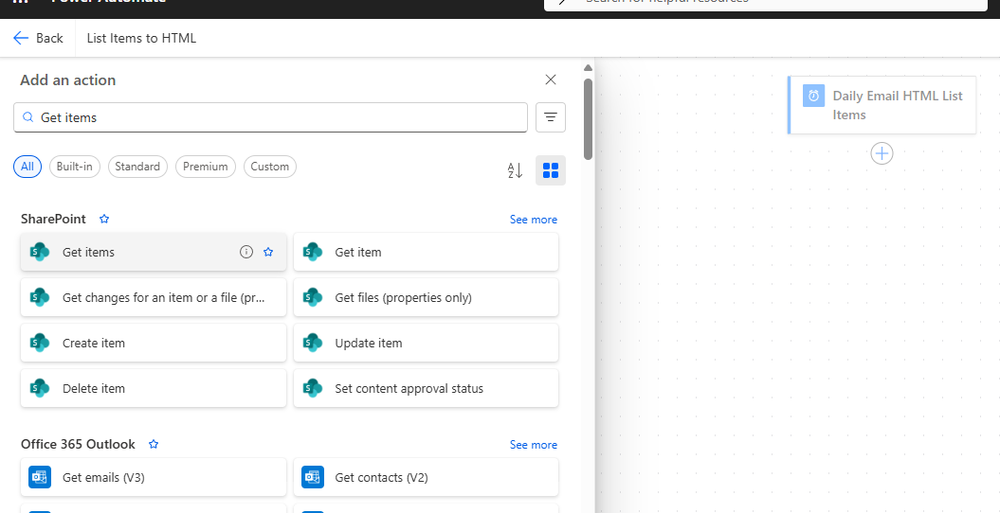

- Set the "Site Address" to your site URL and set the "List Name" to "Orders"

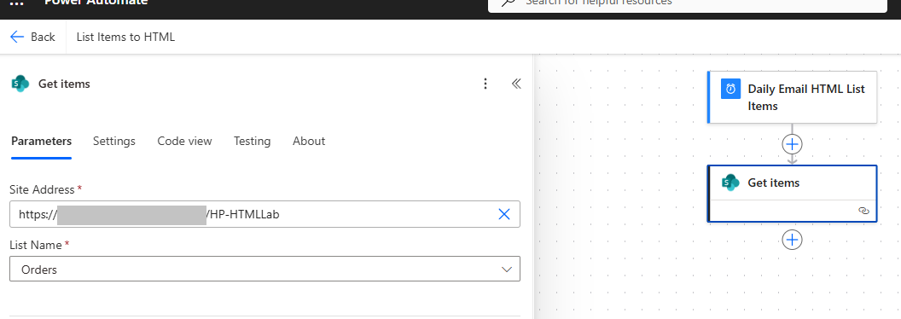

- Click "Show all" next to "Advanced parameters"
- Use something like the following for "Filter Query" to retrieve all orders from the list where "Order Status" is New or Approved and where the Owner Name equals your name: `('Order Status' eq 'New' or 'Order Status' eq 'Approved') and 'Owner Name' eq 'Joe Smith'`
- In many cases, the "OwnerName" filter would be associated to the User Principal Name (email address for the user in the tenant). However, here we are keeping it simple and assigning just a string value for target name.
- Add a new activity, search for "Select", and choose "Select" under "Data Operation"

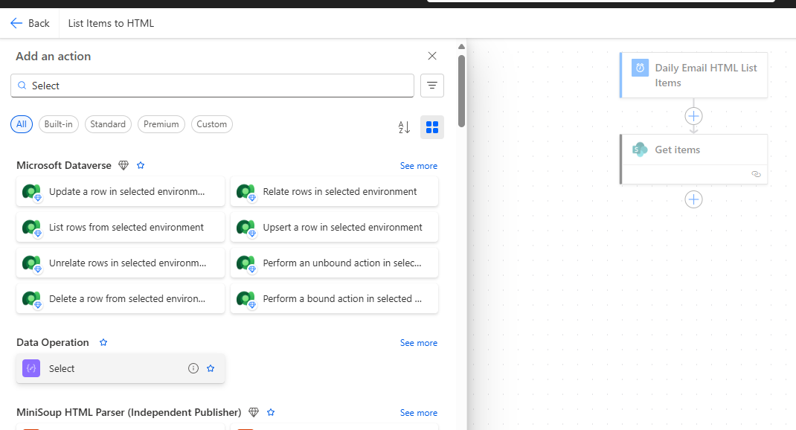

In the "From", click the "lightning bolt" to use dynamic content

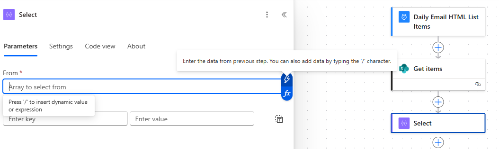

- Select `body/value` under the "Get items" activity

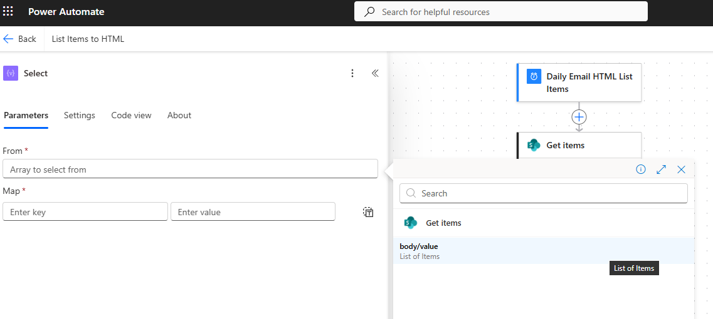

- Use the "Map" area to project field names in the SharePoint list to display names you want to use in the output. Assuming modification of the standard "Title" column in the list to be "Customer Name", you would map "Title" to the target column name of your choosing.

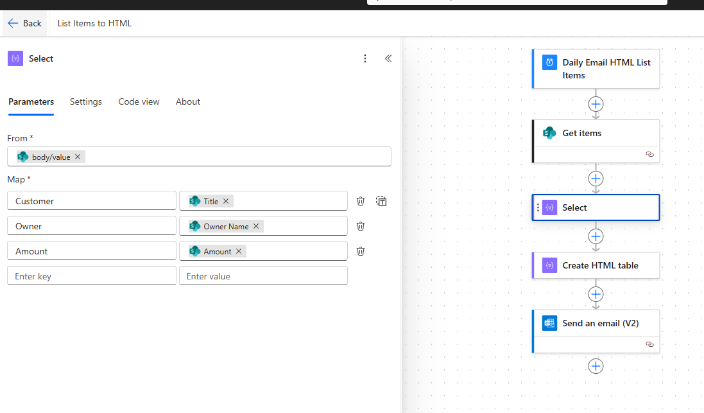

- Add a new activity, search for "HTML", and choose "Create HTML table" under "Data Operation"

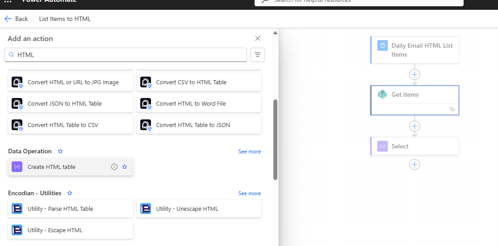

- In the "From", add dynamic content and use "Output" under the "Select" activity

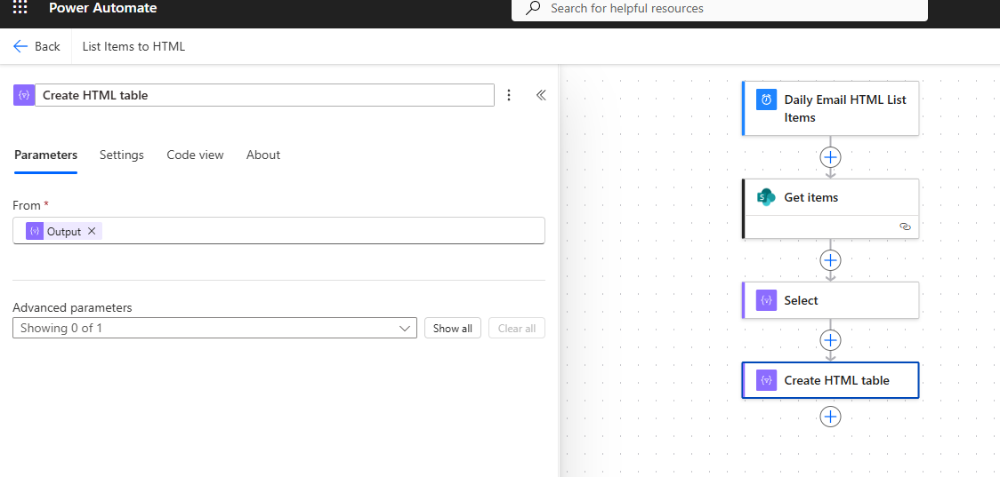

- Add a new activity, search for "email", and choose "Send an email (V2)" under "Office 365 Outlook"

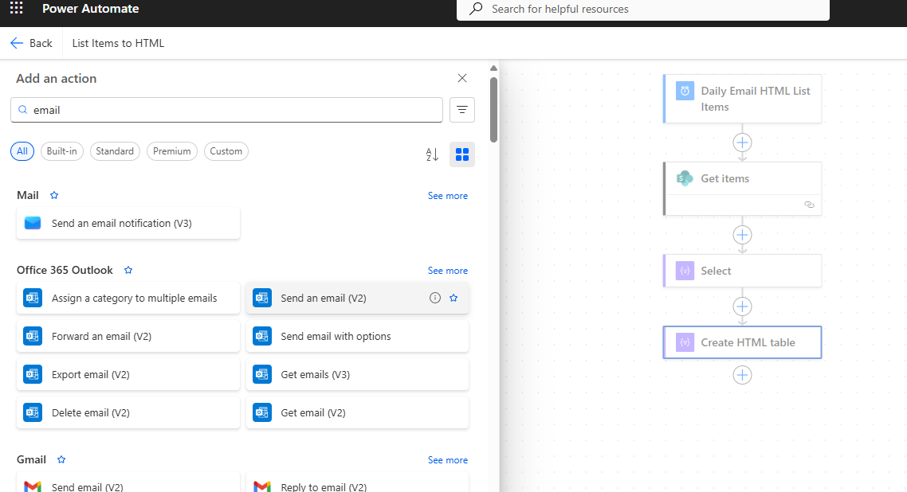

- If necessary, update the connection with sign in using "Change connection"
- In the "To", search for and select your username/email address
- For "Subject", use something like "Your New or Approved Orders"
- For "Body", add dynamic content and use "Output" under the "Create HTML table" activity
- Click "Save" in the upper right
- Create a few items in the list with yourself as the owner (using different statuses)
- In the Power Automate maker portal, click "Test", choose "Manually", and click "Test"
- Click "Run flow" to test the scheduled flow and confirm that the expected data is sent to your email address
- Use the provided link to the "Flow Runs Page" to monitor the run
- Edit the existing flow
- Click on the "Select" activity and modify the "Map" settings, replacing the "Amount" mapping with `formatNumber(item()?['Amount'], 'C')`

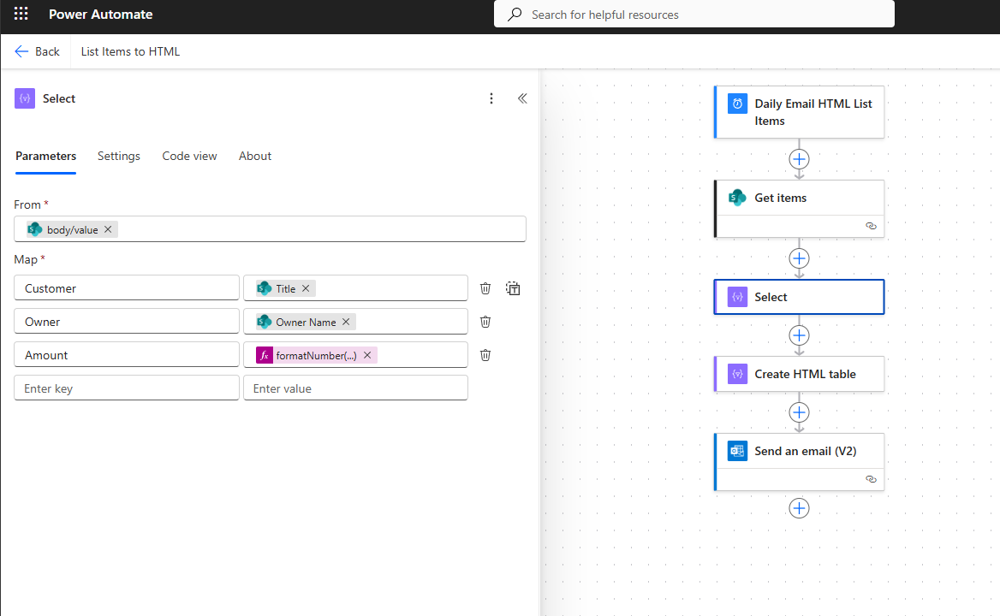

- Save the updates and retest to see the results
